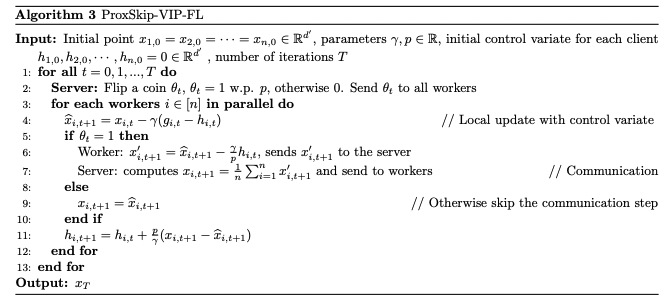

# Communication-Efficient Gradient Descent-Accent Methods for Distributed Variational Inequalities: Unified Analysis and Local Updates

This repository documents the code to reproduce the experiments reported in the paper:

> [Communication-Efficient Gradient Descent-Accent Methods for Distributed Variational Inequalities: Unified Analysis and Local Updates](https://arxiv.org/pdf/2306.05100.pdf)

In this paper, we provide a unified convergence analysis of communication-efficient local training methods for distributed variational inequality problems (VIPs). Our approach is based on a general key assumption on the stochastic estimates that allows us to propose and analyze several novel local training algorithms under a single framework for solving a class of structured non-monotone VIPs. We present the first local gradient descent-accent algorithms with provable _improved communication_ complexity for solving distributed variational inequalities on heterogeneous data. Here is a screenshot of the algorithm for VIP:



If you find our code useful, please cite our work as follow:

```
@article{zhang2023communication,
  title={Communication-Efficient Gradient Descent-Accent Methods for Distributed Variational Inequalities: Unified Analysis and Local Updates},
  author={Zhang, Siqi and Choudhury, Sayantan and Stich, Sebastian U and Loizou, Nicolas},
  journal={arXiv preprint arXiv:2306.05100},
  year={2023}
}
```


## Table of Contents

<!--ts-->
   * [Requirements](#requirements)
   * [Strongly-monotone Quadratic Games](#strongly-monotone-quadratic-games)
   * [Robust Least Square](#robust-least-square)
   * [ProxSkip-VIP-FL vs ProxSkip-L-SVRGDA-FL](#ProxSkip-VIP-FL-vs-ProxSkip-L-SVRGDA-FL)
   * [Low vs High Heterogeneity](Low-vs-High-Heterogeneity)
   * [Performance on Data with Varying Heterogeneity](Performance-on-Data-with-Varying-Heterogeneity)
   
<!--te-->

## Requirements

The required Python packages for running the files are listed below
 * ```numpy```
 * ```matplotlib```
 * ```math```
 * ```time```
 * ```pandas```
 * ```sklearn.datasets```

## Strongly-monotone Quadratic Games

In figure 1 of our work we compare the performance of ProxSkip-GDA-FL (ProxSkip-SGDA-FL) with Local GDA (Local SGDA) and Local EG (Local SEG) on strongly-monotone quadratic games. Please the run the code in [QuadxDet.py](QuadxDet.py) and [QuadxStoch.py](QuadxStoch1.py) for deterministic and stochastic setting respectively. 

## Robust Least Square

In figure 2 of our work we compare the performance of ProxSkip-GDA-FL (ProxSkip-SGDA-FL) with Local GDA (Local SGDA) and Local EG (Local SEG) for Robust Least Square problems. Please the run the code in [RLS_Dataset2.ipynb](RLS_Dataset2.ipynb) to reproduce the plots of Figure 2.
## ProxSkip-VIP-FL vs ProxSkip-L-SVRGDA-FL

## Low vs High Heterogeneity

## Performance on Data with Varying Heterogeneity


